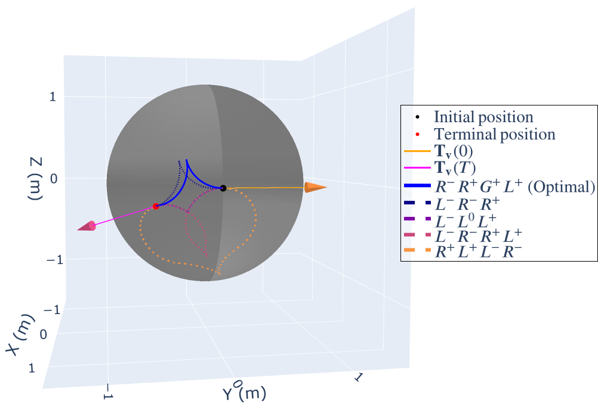

# 🚗 Time-Optimal Path Planning on a Sphere for a Convexified Reeds-Shepp Vehicle

A Python implementation for solving the **time-optimal path problem** of a **convexified Reeds-Shepp vehicle on a sphere**, with visualization.

The peoofs of optimal path characterization are detailed in: 
> Li, S., Kumar, D. P., Darbha, S., & Zhou, Y. (2025). *Time-Optimal Convexified Reeds-Shepp Paths on a Sphere*. arXiv preprint arXiv:2504.00966.

For details on generating candidate paths, please refer to the supplementary note:
**[Note](Convexified_Reeds_Shepp_on_Sphere_Path_Generation.pdf)**


<br><br>

## 🔹 Features
✅ **Time-optimal path and feasible paths generation**  
✅ **Visualization** of the optimal path and feasible paths on a unit sphere  

<br><br>

## 📦 Installation
Using **Python 3.11** and the following dependencies:

```bash
pip install numpy matplotlib plotly scipy
```

<br><br>


## 🚀 Usage

### Solve the Time-Optimal Path Problem and Visualize
```python
from CRS_on_sphere_opt import opt_path_gen, CRS_plot
import numpy as np

terminal_config = np.array([[0.804977,   -0.59221622,  0.03594413],
 		            [-0.56946107, -0.75420323,  0.32694278],
 		            [-0.16651164, -0.2836502,  -0.94436033]]) # Example desired terminal configuration on a sphere (in SO(3))
ini_config = np.eye(3)  # Example start configuration on a sphere (in SO(3))
U_max = 3 # Example maximum truning rate

feas,opt = opt_path_gen(U_max, ini_config, terminal_config) # Solve for the optimal path and all feasible paths

CRS_plot(feas, opt, ini_config, terminal_config) # Plot the optimal path and all feasible paths on a unit sphere
# To plot only the optimal path, replace "feas" with "[]" in CRS_plot()
```

<br><br>

## 📊 Visualization Example
🖼️ Example plot of the optimal path and feasible paths on a sphere:  



<br><br>

## 📖 References

If you use this work, please cite:

```bibtex
@article{li2025time,
  title   = {Time-Optimal Convexified Reeds-Shepp Paths on a Sphere},
  author  = {Li, Sixu and Kumar, Deepak Prakash and Darbha, Swaroop and Zhou, Yang},
  journal = {arXiv preprint arXiv:2504.00966},
  year    = {2025}
}
